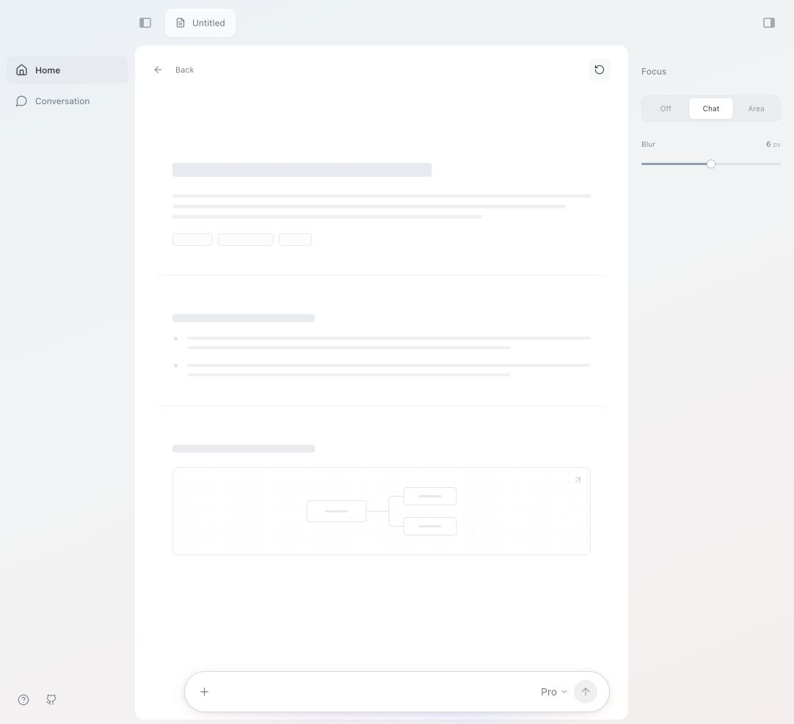

# Float

An open-source prototype for movable chat and contextual focus.

Drag the chat input anywhere on the screen, expand it into a conversation, and blur the surrounding page. The interface keeps navigation and focus controls minimal so attention stays on the centre.



## Try it

[Open the live playground](https://carlholland93.github.io/float/).

Run the playground locally:

```bash
npm install
npm run dev
```

Requires Node.js 22.12+ and npm. Open the local URL printed by Vite.

## Interactions

- **Move:** drag the edge of the input pill, or the conversation header. The panel stays inside the visible viewport.
- **Expand:** choose Open conversation in the `+` menu, use the sidebar, or send a message.
- **Hover:** move over a content card to keep it sharp while the other cards soften. Leaving the card restores the previous focus; Off disables hover focus. Touch screens keep tap-to-select behavior.
- **Focus:** choose Chat to soften the page, or Area to keep one outlined section sharp. Off restores the canvas.
- **Tune:** adjust the blur from 0 to 12px.
- **Dock:** use the `+` menu to place chat at the bottom left, centre, or right.
- **Reset:** return to the initial canvas and clear the demo conversation.

### Keyboard

| Action                                 | Shortcut           |
| -------------------------------------- | ------------------ |
| Focus the chat input                   | `⌘ K` / `Ctrl K`   |
| Move the focused drag handle           | Arrow keys         |
| Move in larger increments              | Shift + arrow keys |
| Dock the focused handle                | Home               |
| Close the conversation and clear focus | Escape             |

## What this prototype does

This is an **interaction prototype**, with local, predefined replies. No AI provider is connected. Messages remain in React memory in the current tab; refreshing clears them. There is no analytics, remote message storage, account system, or API key field.

The page contains faint outlines instead of document content. Selecting an area associates its name with the conversation; it does not extract document text. The visual blur is an attention aid, not a privacy or redaction feature.

The workspace and chat controls follow a Pocket interface reference, including the input shape, labels, expanded panel, and soft blue glow. The page uses neutral outline shapes and sample responses; no reference screenshots or meeting content are included. This independent interface study is not affiliated with Pocket. The Pro selector is a local UI demo and does not select a real model or plan.

## Development

```bash
npm test       # geometry and viewport boundary tests
npm run build # TypeScript validation and production bundle
npm run preview
npm run format:check # verify consistent formatting
```

Built with React, TypeScript, Vite, Tailwind CSS, and Lucide icons. Design tokens are declared in `src/styles.css`.

```text
src/
  App.tsx                 Workspace and focus state
  components/Canvas.tsx   Selectable content outlines
  components/Composer.tsx Floating chat and demo conversation
  components/Controls.tsx Shared controls
  hooks/useFloating.ts    Pointer, keyboard, resize, visual viewport
  lib/geometry.ts         Pure bounds and docking calculations
```

`App.tsx` owns the local reply handler. A future integration can replace that handler with a server-backed provider call. Keep API credentials on the server, and explain to users what selected content is being shared before sending it.

## Contributing

Interaction ideas, bug reports, and small pull requests are welcome. See [CONTRIBUTING.md](CONTRIBUTING.md).

## License

[MIT](LICENSE) © 2026 Charlie Holland.
